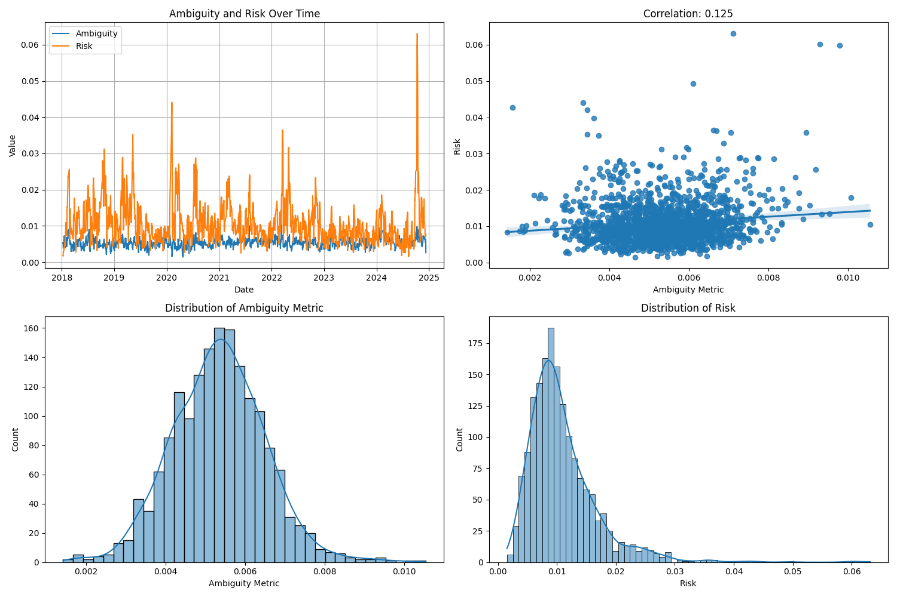
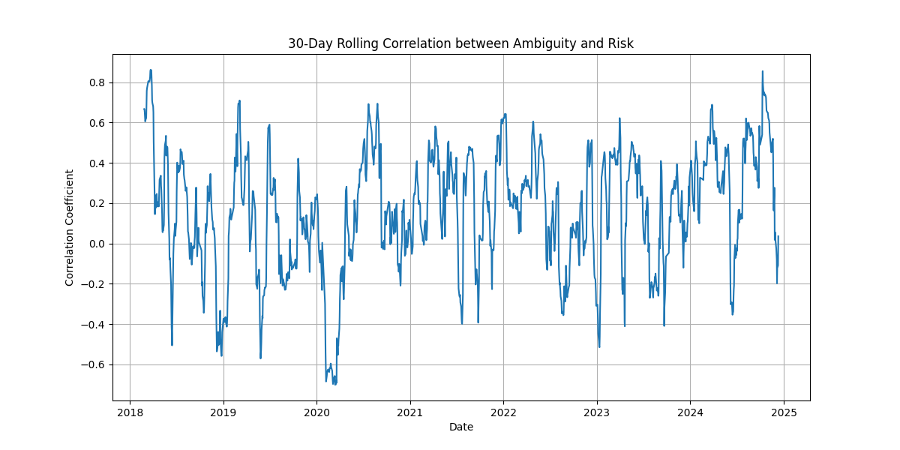

# Stock Price Ambiguity and Excess Returns Analysis

## Overview

This folder contains analysis of the relationship between stock price ambiguity and excess returns, with a particular focus on the dynamic nature of this relationship. The analysis uses minute-level price data from the SSE 300 Index to quantify ambiguity through probability distribution variance and examines its potential contribution to excess returns.

## Methodology

### Ambiguity Measurement

The ambiguity metric is calculated using a rolling window approach that captures the variability in probability distributions of returns. Key components include:

1. **Data Processing**:

   - Minute-level price data from SSE 300 Index
   - Conversion to returns and proper timezone handling (Asia/Shanghai)
   - Rolling window analysis with configurable parameters
2. **Ambiguity Calculation**:

   ```python
   def calculate_ambiguity_and_risk(df, specific_date, window_size=5, num_bins=20):
       # Returns:
       # - ambiguity_metric: Average standard deviation across bins
       # - interval_std: Standard deviations for each bin
       # - risk: Standard deviation of daily returns
   ```

### Analysis Components

The analysis generates several key outputs:

1. **Time Series Analysis**:

   - Daily ambiguity metrics
   - Traditional risk measures (standard deviation of returns)
   - Rolling correlation between ambiguity and risk
2. **Visualization**:

   - Time series plots of ambiguity and risk
   - Scatter plots with regression lines
   - Distribution histograms
   - Rolling correlation plots

## Results

### 1. Time Series Analysis

The analysis reveals the dynamic nature of ambiguity in stock prices. For example, on January 9, 2018:

- Ambiguity Metric: 0.0052
- Risk (Standard Deviation): 0.0017

This indicates that the ambiguity component is significantly larger than the traditional risk measure, suggesting that uncertainty in probability distributions plays a substantial role in market dynamics.

### 2. Correlation Analysis

The analysis includes:

- Pearson correlation coefficient between ambiguity and risk
- Statistical significance tests
- Rolling correlation analysis (30-day window)

### 3. Distribution Analysis

The results show:

- Distribution of ambiguity metrics
- Distribution of risk measures
- Temporal evolution of both metrics

### Joint Dynamics of Ambiguity and Risk



The figure above provides a comprehensive overview of the relationship between ambiguity and traditional risk in the SSE 300 Index:

* Top Left (Time Series Plot):

This subplot shows the daily evolution of the ambiguity metric (blue) and the standard deviation of daily returns (risk, orange). Notably, ambiguity often exceeds risk in magnitude, and both metrics exhibit substantial time variation. Periods of high ambiguity do not always coincide with periods of high risk, suggesting that ambiguity captures a distinct aspect of market uncertainty.

* Top Right (Scatter Plot with Regression):

This scatter plot visualizes the relationship between ambiguity and risk across all days. The regression line and the reported Pearson correlation coefficient quantify the average association between the two. The relationship is positive but far from perfect, indicating that ambiguity and risk are related but not redundant.

* Bottom (Histograms):

The lower subplots show the distributions of the ambiguity metric and risk, respectively. Ambiguity displays a wider spread, reinforcing the idea that it captures additional uncertainty not reflected in standard risk measures.

### Time-Varying Correlation



The above figure illustrates the 30-day rolling correlation between ambiguity and risk over the sample period. Several key insights emerge:

* Non-Constant Relationship:

The correlation fluctuates substantially over time, ranging from strongly positive (>0.8) to negative (<-0.6). This demonstrates that the link between ambiguity and risk is not stable, but instead varies with market conditions.

* Implications for Excess Return:

The time-varying nature of the correlation suggests that the marginal contribution of ambiguity to excess returns is itself dynamic. There are periods when ambiguity and risk move together, and others when they diverge, potentially offering opportunities for return prediction or risk management that go beyond traditional volatility measures.

## Key Findings

1. **Ambiguity-Risk Relationship**:

   - The relationship between ambiguity and risk is not static
   - Rolling correlation analysis shows varying degrees of association over time
   - Ambiguity often exceeds traditional risk measures
2. **Market Implications**:

   - Ambiguity appears to be a significant component of market uncertainty
   - The dynamic nature of ambiguity suggests potential for excess returns
   - Traditional risk measures may underestimate total market uncertainty

## Technical Implementation

The analysis is implemented in Python using:

- pandas for data manipulation
- numpy for numerical operations
- matplotlib and seaborn for visualization
- scipy for statistical analysis

## Usage

To reproduce the analysis:

```python
# Load and prepare data
file_path = 'path_to_data/SSE.000300.csv'
df = load_and_prepare_data(file_path)

# Calculate metrics
specific_date = '2018-01-09'
window_size = 5
num_bins = 50

ambiguity_metric, interval_std, risk = calculate_ambiguity_and_risk(
    df, 
    specific_date, 
    window_size=window_size, 
    num_bins=num_bins
)
```

## Future Work

1. **Dynamic Analysis**:

   - Investigate time-varying effects of ambiguity on returns
   - Develop models that account for changing ambiguity-risk relationships
2. **Portfolio Implications**:

   - Study the impact of ambiguity on portfolio construction
   - Develop ambiguity-aware investment strategies
3. **Market Conditions**:

   - Analyze ambiguity patterns during different market regimes
   - Investigate the role of ambiguity in market stress periods

## Contributing

Contributions are welcome! Please feel free to submit a Pull Request.
